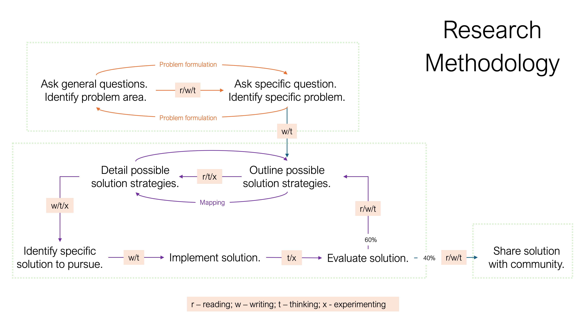

## Course Background

- **FRSC 5003H** is a graduate course in the MScFS program, that:
    - covers topics of importance to conducting effective research
    - allows students to **practice** applying skills in preparation for life outside of school  
    
- Primary areas of emphasis are research design, critical thinking, and basic data analysis

- Secondary area of emphasis is advanced data analysis; reading and writing source code in the **R programming language**

::: {.notes}

:::

## Instructor

- **Name**: Dr. Arun Moorthy (rhymes with *maroon earthy*)
- **Position**: Assistant Professor, Forensic Science
- **Research Areas:** Computational Methods, Forensic Chemistry   
- **Office**: DNA B108.11
- **Office Hours**: Tuesday 9am to 11am
- **Email**: arunmoorthy@trentu.ca (usually respond within 48 hours)

## Course Structure

- **Most Lectures**:
    - 45-50 minutes for presentation about lecture topic; rest of the time to discuss lecture topics and other topics of interest, work on assignments/activities   
    
- **Most Seminars**:
    - **OPEN WORK SESSIONS**: Time to work on research activities, study for test, read optional papers, prepare for your placement, etc.   
    
- **All lectures will be live streamed and recorded.**

## Assessments

**Test 1**: Fundamentals in Probability and Statistics

- Goal: Develop mastery of basic concepts in probability and statistics
- Test will be open-notes and run through blackboard; 30 questions that are randomly selected from carefully designed pools
    - questions are revealed one at a time, and there is no backtracking
    - 60-minute time limit
- There will be a practice test (10 questions, 20-minute time limit) available for you via blackboard; you can attempt it up to three times
- There will be practice problem sets (with no time limit) available to you via blackboard
  
## Assessments

**Test 2**: Advanced Topics in Data Analysis 

- Goal: Develop comfort with more advanced topics and methods in data analysis
- Test will be open-notes and run through blackboard; 3 "assignments" that are randomly selected from carefully designed pools
     - assignments are revealed all at once
     - 100-minute time limit
- There will be practice assignments (with no time limits) available to you via blackboard

## Assessments

**Research Activity 1** - Statement of Work

- Goal: practice developing and writing an SOW
- You will each receive a rough project description and the name of a client; **you will write an SOW for your client's project**
- This is an *individual assignment*
- Challenges:
    - Defining the problem / scoping the work
    - Selecting methods
    - Outlining realistic deliverables / setting expectations
    - **COMMUNICATING WITH CLIENT**

## Assessments

**Research Activity 2** - Research Proposal 

- Goal: Practicing developing and writing a research proposal **as a member of a research team**.
- A "Call for Proposal" will be available on Blackboard, as well a group membership list
- Challenges: 
    - Defining the problem / Demonstrating or motivating the problem
    - Determining methods / Determining potential external reviewers
    - Outlining realistic deliverables / setting expectations
    - Working as a group

## Assessments

**Research Activity 3** - "Desk Study" (continuing from 5001H)

- Goal: Give you the time and space to fill a gap in your knowledge and dive deep into the literature of a topic that interests YOU, building your skills in research. Allow you to share your insights through long-form technical writing and a poster presentation, building your skills in communication
- Your M.Sc.F.S. "[magnum opus](https://www.merriam-webster.com/dictionary/magnum%20opus){target="_blank"}"

- Challenges:
    - Choosing a topic / scoping a topic
    - Comprehensive reading
    - Staying motivated / being disciplined
    

    
## A note on templates and resources
- I will include several templates and resources on the course Blackboard that you can use as guidance for your assignments--do not feel obligated to use these templates  
- Please let me know if you think of a useful template for other documents that are not in the Resources folder

## Policy (see syllabus for details)

- **Attendance:** Recommended. But do what you need to do.  
- **Due dates:** All assignments must be submitted prior to their due dates to be considered for grades.  
- **AI use:** Use it to help you learn concepts, but understand the risks.

## {.center}

::: {.text-center}
A quick tour of the course blackboard
:::

## {.center}

::: {.text-center}
The craft of research
:::

## What is research?

- Activities undertaken to help update our knowledge and/or improve our understanding of a subject 

    - **Learning is personal:** we carry out learning activites (e.g., taking classes, reading) to extend or improve our personal understanding of a subject
    - **Research is social:** we carry out research activities (e.g., asking questions, designing and coducting studies, publishing papers) to extend or improve our communities understanding of a subject  

::: {.fragment}
*Cue: "I learn to things that I don't know. I research things (to ask and answer questions) that no one knows."*
:::

## Reasons people conduct research

- **Depth of knowledge:** desire a deep understanding of a subject matter; being or becoming an expert
- **Discovery / Creative outlet:** enjoy contemplating questions / solving problems
- **Service to society:** generating knowledge and insights that can improve downstream service activities/policy
- **Service to commerce:** generating knowledge and insights that can improve systems/processes/management
- **Degree requirements:** all graduate programs have a research component.

## Methods vs Methodology

- **Research Methods:** the specific tools and approaches used to complete a research project
    - Documentation of research methods are an important part of writing a research paper, thesis, case report, etc.
    - Needed for reproducibility  
    
- **Research Methodology:** the study of methods; the *general strategies* and approaches for conducting research 
    - "The craft..."

## General steps in the craft of research

- **Problem formulation:** The goal of this step is to identify one or more "robust" (tractable, feasible) research questions that are *worth* pursuing.   

- **Experimentation and analysis:** The goal in this step is to design specific studies (experiments, surveys, etc.) and analytical methods that *best* answer research questions   

- **Dissemination:** The goal at this step is to present your data and/or *insights* so that others in the community can benefit from the work.

## {.center}

{width=50%}

## The professional researcher's toolbox

- Literature databases
- Reference manager
- Word Processor (or other writing tool)
- Image Editor
- Spreadsheets
- Statistical Analysis Software

## Literature Database

- **New developments** in science are traditionally disseminated through written communications
    - Journal articles (research, reviews, short communications, technical notes)
    - Conference proceedings
    - Technical Reports
    - Edited collections
    - Pre-print (unofficially published) manuscripts  
    
- Particularly interesting developments may also result in press releases

## Literature Database

- General purpose databases:
    - Google scholar
    - PubMed
    - EBSCO
    - JSTOR   
- Field specific databases: [https://guides.lib.trentu.ca/az/databases](https://guides.lib.trentu.ca/az/databases){target="_blank"}
    - [https://forensiclibrary.org/home](https://forensiclibrary.org/home){target="_blank"}  (they have a mailing list with daily updates)
    
    
## Reference Manager

- A tool that can help with organizing and working with references   
- Some useful software reference managers 
    - [Zotero](https://www.zotero.org/){target="_blank"} (Free, Arun's Choice)
    - [Mendeley](https://www.mendeley.com/){target="_blank"} (Free)
    - [EndNote](https://endnote.com/?srsltid=AfmBOoqZ2wMT-IWdT3qXCvIfND08CH-jvSztUnnph0X2wbcax9Pd6pfJ){target="_blank"}(Paid)
    - [Paperpile](https://paperpile.com/){target="_blank"}(Paid)

## Word processor

- A tool that allows you to create and edit written documents

- Example software word processors:
    - MS Word (Paid, Arun's 2nd Choice)
    - Google Docs (Free)
    - WPS Office (Free)
    - Word Editor (Free)
    - Canva Docs (Paid)
    - Text editor with a markup language (Free, Arun's 1st Choice)
        - Latex 
        - Markdown 
        - Quarto 

        
## Image Editor

- A tool that allow you to manipulate an image
- Useful for creating schematics and flow charts, presentations; can be used to annotate plots and figures
- Example software image editors:
    - Photoshop (Paid)
    - GIMP (Free, Arun's Choice)
    - SketchUp (Paid)
    - Powerpoint (Paid, Arun's 2nd Choice)
    
## Spreadsheets

- A tool that allows you to track and organize data
- Example software spreadsheets:
    - MS Excel (Paid, Arun's Choice)
    - Google Sheets (Free)
    - Apple Numbers (Paid)
    
## Statistical Software 

- A software tool with several data analysis and statistics procedures implemented
  - MS Excel w/data analysis tool pack (Paid)
  - SPSS, SAS, Minitab (Paid)
  - JASP (Free, Arun's interested in learning more)
  - R (Free, Arun's 1st choice)
  
- Some data analysis procedures are beyond what is available in software tools; requires custom code
    - Interpreted language (e.g., R, Python); compiled language (e.g., C, Fortran)
    
## Summary

- Research activities are undertaken to help update our knowledge and/or improve our understanding of a subject 
- There are several reasons why people conduct research
- Your "craft" is your methodology
    - improving your ability to formulate good problems/questions, design studies and analyze data, and communicate your results takes time and practice
- There are several general tools that a researcher should be comfortable using (in addition to their field specific tools)
    - improving skills with the tools takes time and practice

## {.center}
::: {.text-center}
"Research is formalized curiosity. It is poking and prying with a purpose."   
- Zora Neale Hurston
:::

## {.center}
::: {.text-center}
Introducing your M.Sc.F.S. Desk Study
:::