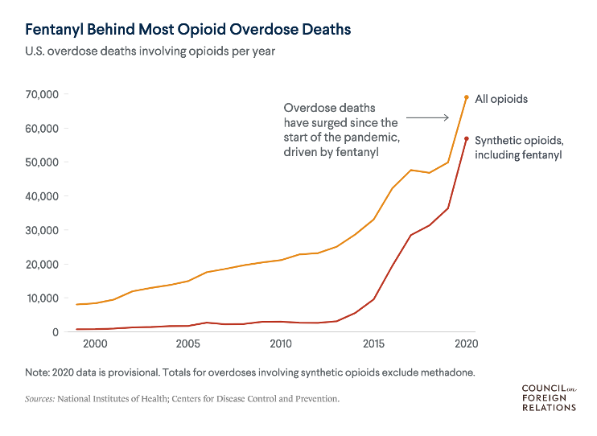

## Course Background

- **FRSC 5003H** is a graduate course in the MScFS program, that:
    - covers topics of importance to conducting effective research
    - allows students to **practice** applying skills in preparation for life outside of school  
    
- Primary areas of emphasis are research design, critical thinking, and basic data analysis

- Secondary area of emphasis is advanced data analysis; reading and writing source code in the **R programming language**

::: {.notes}

:::

## Instructor

- **Name**: Dr. Arun Moorthy (rhymes with *maroon earthy*)
- **Position**: Assistant Professor, Forensic Science
- **Research Areas:** Computational Methods, Forensic Chemistry   
- **Office**: DNA B108.11
- **Office Hours**: Tuesday 9am to 11am
- **Email**: arunmoorthy@trentu.ca (usually respond within 48 hours)

## Course Structure

- **Most Lectures**:
    - 45-50 minutes for presentation about lecture topic; rest of the time to discuss lecture topics and other topics of interest, work on assignments/activities   
    
- **Most Seminars**:
    - **OPEN WORK SESSIONS**: Time to work on research activities, study for test, read optional papers, prepare for your placement, etc.   
    
- **All lectures with software demonstrations will be recorded.**

## Assessments

**Test 1**: Fundamentals in Probability and Statistics

- Goal: Develop mastery of basic concepts in probability and statistics
- Test will be open-notes and run through blackboard; 30 questions that are randomly selected from carefully designed pools
    - questions are revealed one at a time, and there is no backtracking
    - 60-minute time limit
- There will be a practice test (10 questions, 20-minute time limit) available for you via blackboard; you can attempt it up to three times
- There will be practice problem sets (with no time limit) available to you via blackboard
  
## Assessments

**Test 2**: Advanced Topics in Data Analysis 

- Goal: Develop comfort with more advanced topics and methods in data analysis
- Test will be open-notes and run through blackboard; 3 "assignments" that are randomly selected from carefully designed pools
     - assignments are revealed all at once
     - 100-minute time limit
- There will be practice assignments (with no time limits) available to you via blackboard

## Assessments

**Research Activity 1** - Statement of Work

- Goal: practice developing and writing an SOW
- You will each receive a rough project description and the name of a client; **you will write an SOW for your client's project**
- This is an *individual assignment*
- Challenges:
    - Defining the problem / scoping the work
    - Selecting methods
    - Outlining realistic deliverables / setting expectations
    - **COMMUNICATING WITH CLIENT**

## Assessments

**Research Activity 2** - Research Proposal 

- Goal: Practicing developing and writing a research proposal **as a member of a research team**.
- A "Call for Proposal" will be available on Blackboard, as well as assigned teams
- Challenges: 
    - Defining the problem / Demonstrating or motivating the problem
    - Determining methods / Determining potential external reviewers
    - Outlining realistic deliverables / setting expectations
    - Working as a group

## Assessments

**Research Activity 3** - "Desk Study" (continuing from 5001H)

- Goal: Give you the time and space to dive deep into the publicly available information of a question/topic that interests YOU, building your skills in research. Allow you to share your insights through long-form technical writing and a poster presentation, building your skills in communication
- Your M.Sc.F.S. "[magnum opus](https://www.merriam-webster.com/dictionary/magnum%20opus){target="_blank"}"

- Challenges:
    - Coming up with a topic / scoping your question
    - Comprehensive reading / finding information
    - Staying motivated / being disciplined
    
## A note on templates and resources
- I will include several templates and resources on the course Blackboard that you can use as guidance for your assignments--do not feel obligated to use these templates  
- Please let me know if you think of a useful template for other documents that are not in the Resources folder

## Policy (see syllabus for details)

::: {.nonincremental}
- **Attendance:** Same as 5001H
- **Due dates:** Same as 5001H
- **AI use:** Same as 5001H
:::

## {.center}

::: {.text-center}
A quick tour of the course blackboard
:::

## {.center}

::: {.text-center}
The craft of research
:::

## What is research?

- Any activity undertaken to help update our knowledge and/or improve our understanding of a subject  

    - **Learning:** the answers are known (or thought to be known)
    - **Research:** the answers are unknown (or thought to be unknown)

## Reasons people conduct research

- **Depth of knowledge:** need bleeding-edge understanding of a subject matter; are (or desire to be) an expert  
- **Solving problems:** need deeper understanding of a subject matter (and its limitations) in order to solve a problem  
- **Making decision:** need deeper understanding of a subject matter (and its limitations) in order to make justifiable decisions

## Methods vs Methodology

- **Research Methods:** the specific tools and approaches used to complete a research project
    - Documentation of research methods are an important part of writing a research paper, thesis, case report, etc.
    - Needed for reproducibility  
    
- **Research Methodology:** the study of methods; the *general strategies* and approaches for conducting research 
    - "The craft..."

## General steps in the craft of research

- **Problem formulation:** The goal of this step is to identify one or more "robust" (tractable, feasible) research questions that are *worth* pursuing.   

- **Experimentation and analysis:** The goal in this step is to design specific studies (experiments, surveys, etc.) and analytical methods that *best* answer research questions   

- **Dissemination:** The goal at this step is to present your data and/or *insights* so that others in the community can benefit from the work.

## {.center}

{width=50%}

## Problem Formulation
::::{.columns}

:::{.column width="50%"}
 
In 2016, I was assigned to "help law enforcement (forensic science labs) identify fentanyl analogs?"  

:::{style="font-size: 80%;"}
- **Challenge 1:** Figure out why forensic science labs were unable to identify fentanyl analogs.

- **Challenge 0:** Figure out how forensic science labs identify any drugs.
:::

:::

:::{.column width="50%"}
 
{width=100%}
:::

::::

## How forensic science labs identify drugs
  
{width=100%}

## How forensic science labs identify drugs
  
{width=100%}

[Mass spectral library searching only works if you have a representative reference spectrum of your analyte!!]{style="color:blue;"}

## Mapping

Problem: Mass spectral library searching does not work when trying to identify novel compounds.  

- Solution 1: Develop new analytical chemistry technique for novel compound identification
    - [I do not know how to develop analytical chemistry techniques.. this is outside of my wheel-house]{style="color:red;"}

## Mapping

Problem: Mass spectral library searching does not work when trying to identify novel compounds.  

- Solution 2: Try to predict what future "fentanyl analogs" may be coming to the market; expand library to include novel compounds.
    - Solution 2a: [Synthesize novel fentanyl, take measurement]{style="color:red;"}
    - Solution 2b: [Generate predicted spectra using DFT or other comp. chem technique.]{style="color:orange;"}
    - Solution 2c: [Generate predicted spectra using machine learning or other applied mathematics technique.]{style="color:green;"}
        - [How do we verify the "truth" of the predicted spectrum? Only possible after novel fentanyl is synthesized and measured.]{style="color:orange;"}

## Mapping

Problem: Mass spectral library searching does not work when trying to identify novel compounds.  

- Solution 3: Can we develop a new search method that uses current library to find a "neighborhood" for a novel drug?
    - Solution 3a: [Revisit how we compute spectral similarity, using linear algebra and other applied mathematics techniques]{style="color:green;"}
        - [Can a "neighborhood" designation be enough evidence for prosecution?]{style="color:orange;"}
        
## Solution Implementation, Evaluation, Dissemination

- wrote an article describing an updated similarity measure (2017)
    - based on an interpretation technique that was described in the literature in the 1940s  
- wrote an article describing the [Fentanyl Classifier](https://asm3-trentu.shinyapps.io/CRAFTS-LAB_FentanylClassifier/) software tool for inferring structural substitutions based on mass spectral similarity with nearest neighbors for simple fentanyl analogs (2020)  
- wrote an article describing the challenges with more complicated substitutions (2023)  

## {.center}

{width=50%}

## The professional researcher's toolbox

- Literature databases
- Reference manager
- Word Processor (or other writing tool)
- Image Editor
- Spreadsheets
- Statistical Analysis Software

## Literature Database

- **New developments** in science are traditionally disseminated through written communications
    - Journal articles (research, reviews, short communications, technical notes)
    - Conference proceedings
    - Technical Reports
    - Edited collections
    - Pre-print (unofficially published) manuscripts  
    
- Particularly interesting developments may also result in press releases

## Literature Database

- General purpose databases:
    - [Google scholar](https://scholar.google.ca/intl/en/scholar/about.html){target="_blank"}
    - [PubMed](https://pubmed.ncbi.nlm.nih.gov/about/){target="_blank"}
    - [EBSCO](https://about.ebsco.com/about/mission){target="_blank"}
    - [JSTOR](https://about.jstor.org/){target="_blank"}   
- Field specific databases: [https://guides.lib.trentu.ca/az/databases](https://guides.lib.trentu.ca/az/databases){target="_blank"}
    - [https://forensiclibrary.org/home](https://forensiclibrary.org/home){target="_blank"}  (they have a mailing list with daily updates)
    
    
## Reference Manager

- A tool that can help with organizing and working with references   
- Some useful software reference managers 
    - [Zotero](https://www.zotero.org/){target="_blank"} (Free, Arun's Choice)
    - [Mendeley](https://www.mendeley.com/){target="_blank"} (Free)
    - [EndNote](https://endnote.com/?srsltid=AfmBOoqZ2wMT-IWdT3qXCvIfND08CH-jvSztUnnph0X2wbcax9Pd6pfJ){target="_blank"}(Paid)
    - [Paperpile](https://paperpile.com/){target="_blank"}(Paid)

## Word processor

- A tool that allows you to create and edit written documents

- Example software word processors:
    - [Microsoft Word](https://support.microsoft.com/en-us/word/word-for-new-users){target="_blank"} (Paid, Arun's 2nd Choice)
    - [Google Docs](https://support.google.com/docs/answer/7068618?hl=en&co=GENIE.Platform%3DDesktop){target="_blank"} (Free)
    - [Kingsoft WPS Writer](https://www.wps.com/academy/a-step-by-step-guide-to-wps-office/about-wps/1872900/){target="_blank"} (Free)
    - [Canva Docs](https://www.canva.com/help/about-canva-docs/){target="_blank"} (Paid)
    - Text editor with a markup language (Free, Arun's Choice)
        - [Latex](https://www.overleaf.com/learn/latex/Learn_LaTeX_in_30_minutes){target="_blank"} 
        - [Markdown](https://www.markdownguide.org/getting-started/){target="_blank"} 
        - [Quarto](https://quarto.org/docs/get-started/){target="_blank"} 

        
## Image Editor

- A tool that allow you to manipulate an image
- Useful for creating schematics and flow charts, presentations; can be used to annotate plots and figures
- Example software image editors:
    - [Photoshop](https://www.adobe.com/products/photoshop/how-to-use.html){target="_blank"} (Paid)
    - [GIMP](https://www.gimp.org/){target="_blank"} (Free, Arun's Choice)
    - [SketchUp](https://sketchup.trimble.com/en/plans-and-pricing/sketchup-ai?utm_source=google&utm_medium=paid_search&utm_campaign=SU_Brand_Search_Brand+Top+Terms+Exact_NORAM&gclsrc=aw.ds&gad_source=1&gad_campaignid=20572302136&gbraid=0AAAAADvM7aZwe8-ikGkuvQtEf4mzj-pJZ&gclid=Cj0KCQjwk5nVBhDiARIsAHNGqadN7gSC1GWUlZMHtLY_uwTN6TnU5jNknn-BYswjI3P_-fGkWZFrU2caAp09EALw_wcB){target="_blank"} (Paid)
    - [Microsoft Powerpoint](https://tech.yahoo.com/computing/articles/edit-photos-pro-powerpoint-133016713.html?guccounter=1&guce_referrer=aHR0cHM6Ly93d3cuZ29vZ2xlLmNvbS8&guce_referrer_sig=AQAAAGfaN0Z5iCOwD1JFoZ6aJNwXL3QBubSvCnV49jB5isxG3xgpQb8qMivyppFq-1LTWa3IdVfQcfF5cLJSA2dsjVc6s7M4CZfI0VqcWJYHLWlcqvKupgVvvYBA-Zny0WT0QpX5a9zU8Xl3q95j1E2JAz09zLdGHpbZ_XHvLv72MoGJ){target="_blank"} (Paid, Arun's 2nd Choice)
    
## Spreadsheets

- A tool that allows you to track and organize data
- Example software spreadsheets:
    - [MS Excel](https://support.microsoft.com/en-us/excel/basic-tasks-in-excel){target="_blank"} (Paid, Arun's Choice)
    - [Google Sheets](https://support.google.com/a/users/answer/9282959?hl=en){target="_blank"} (Free)
    - [Apple Numbers](https://support.apple.com/en-ca/guide/numbers/tan398cb0564/mac){target="_blank"} (Paid)
    
## Statistical Software 

- A software tool with several data analysis and statistics procedures implemented
  - [MS Excel w/data analysis tool pack](https://www.excel-easy.com/data-analysis.html#google_vignette){target="_blank"} (Paid)
  - [SPSS](https://www.spss-tutorials.com/basics/){target="_blank"}, [SAS](https://guides.libraries.psu.edu/c.php?g=1493530&p=11153009){target="_blank"}, [Minitab](https://www.minitab.com/en-us/products/minitab/quick-start/){target="_blank} (Paid)
  - [JASP](https://jasp-stats.org){target="_blank"} (Free, Arun's interested in learning more)
  - [R](https://www.r-project.org){target="_blank"} (Free, Arun's Choice)
  
- Some data analysis procedures are beyond what is available in software tools; requires custom code
    - Interpreted language (e.g., R, Python); compiled language (e.g., C, Fortran)
    
## Summary

- Research is any activity undertaken to help update our knowledge and/or improve our understanding of a subject 
- There are several reasons why people conduct research
- Your "craft" is your methodology
    - improving your ability to formulate good problems/questions, design studies and analyze data, and communicate your results takes time and practice
- There are several general tools that a researcher should be comfortable using (in addition to their field specific tools)
    - improving skills with the tools takes time and practice

## {.center}
::: {.text-center}
"Research is formalized curiosity. It is poking and prying with a purpose."   
- Zora Neale Hurston
:::

## {.center}
::: {.text-center}
Introducing your M.Sc.F.S. Desk Study
:::

## What is a desk study?
- The term *desk study* describes research that one can complete from a desk

    - Reviewing published literature (literature review)
    - Analyzing existing data sets (exploratory data analysis, meta-analysis)  
    - Examining government/public records, reports
    - Press/News articles
    - Product description, online advertisements
    - Social media posts, Reddit...
    - Maps, images, other time-stamped online activities...  

::: {.notes}  
- Challenges: verifying credibility of information, drawing conclusions
   "What is something you can investigate from your computer, without collecting new data?"
:::
 
## Why do a desk study?

1. Because this will help you develop/practice important skills   
2. Because you have an opportunity to do what you want(ish)...  
3. Because you will have accomplished something really personal, and have awesome outputs that you can share at the end of 8 months

## How do you start a desk study?

- Start with a general question. Explore the topic.
- Develop a more specific question. Explore the topic.
- Develop a more refined question. Explore the topic ...   

    - September/October: Read (and document); be open to ideas 
    - November: Reflect on the question(s) that you want to explore
    - December-March: Investigate your question(s), from your desk
    - April: Share your findings
    
::: {.notes}
- Your question will help dictate what "evidence" you need to explore
- Your evidence will help dictate what "analysis" needs to be done
:::
 
## Requirements of your M.Sc.FS. Desk Study:

1. Your desk study should explore a question/topic that may be of interest to the forensic science community
2. Your desk study should be **more than a summary of literature**, it should involve some **critical analysis and original thought**
3. Five deliverables:
      a. [Interim Report (November 30th, 2026)]{style="color: orange;"} 
      b. [Interim Report Meeting (Week of December 7th-11th, 2026)]{style="color: orange;"} 
      c. [Final Report (March 26, 2027)]{style="color: blue;"} 
      d. [Digital Poster Presentation (April 3, 2027 - During 5003H seminar)]{style="color: blue;"}
      e. [Final Digital Poster (April 3, 2027)]{style="color: blue;"}

## Seminar Activity 

::: {.nonincremental}
1. Split into groups  
2. Review the desk study material available on blackboard (10 minutes)  
3. Question break (10 minutes)  
4. Try to come up with questions that you *might be able to answer* with existing information (10 or 15 minutes)
:::

::: {.notes}
- what are the reporting requirements for seized drugs in various jurisdictions? how has that changed with time? 
- what have been the impact of event X on behaviour Y
:::
